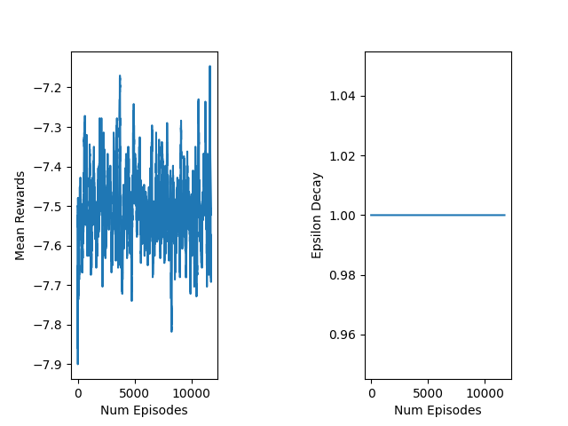
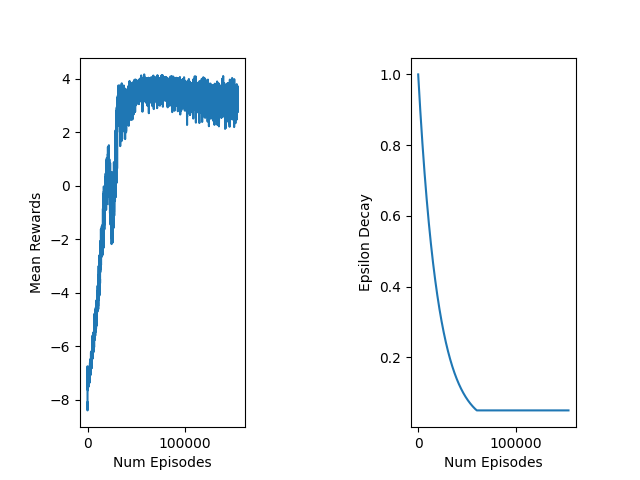
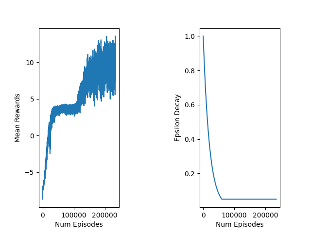
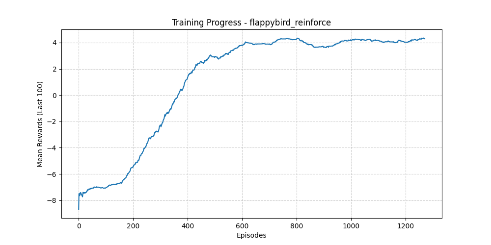

<<<<<<< HEAD
Environment setup :-

Setup your dqn evn using Anaconda : conda create -n dqnenv

Activate your env : conda activate dqnenv

install python 3.11 : conda install python=3.11 

install flappy bird module using :- pip install flappy-bird-gymnasium

install Pytorch : pip install pytorch

install yaml

Debugging :-
Python

Interpreter :-
Python3.11(dqn)(Created Environment)

Training :-

Run the code in terminal.

To train Flappy Bird: python agent.py flappybird1 --train, or python reinforce_agent.py 'name' -- train

'flappybird1' can be the name of any defined hyperparameter blocks.

Testing / Watching the Agent Play : python agent.py flappybird1

Monitoring Progress (While Training): Get-Content ./runs/flappybird1.log -Wait

Playing in the environment :-

To play the game (human mode), run the following command: flappy_bird_gymnasium

To see a random agent playing, add an argument to the command: flappy_bird_gymnasium --mode random

To see a Deep Q Network agent playing, add an argument to the command: flappy_bird_gymnasium --mode dqn

# Flappy Bird AI, deep Reinforcement Learning
A study on training agents to master Flappy Bird using various Reinforcement Learning architectures, including DQN, Double DQN, Dueling DQN, and REINFORCE.

### Background & Motivation:

### Methodology:
This project uses flappy-bird-gymnasium as the environment. The state space consists of the bird's horizontal and vertical distance to the next set of pipes, as well as its velocity.

Deep Q-Networks (DQN): We utilize a neural network to approximate the Q-value function. To stabilize training, we implemented Experience Replay to break temporal correlations and a Target Network to provide stable Q-value targets.

Dueling Architecture: By splitting the network into two streams, the agent learns which states are inherently valuable without having to learn the effect of each action for every single state.

REINFORCE: Unlike the Q-learning agents, this policy-gradient method learns a probability distribution over actions, allowing for more fluid decision-making.

### Results:
Below is the performance of the various agents after training.

#### Random agent
  

#### Dueling DQN agent
  

#### Dueling DDQN agent

#### REINFORCE Agent
      

The Dueling Double DQN (DDQN) showed the most stable convergence and highest average scores and so was the best performing method for this problem.